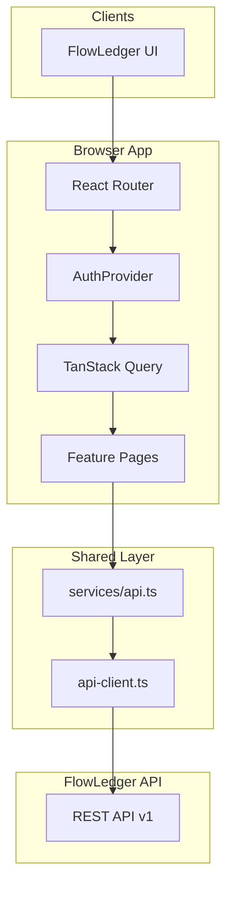
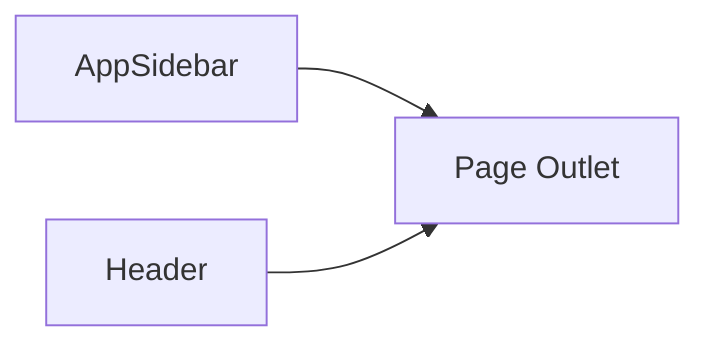
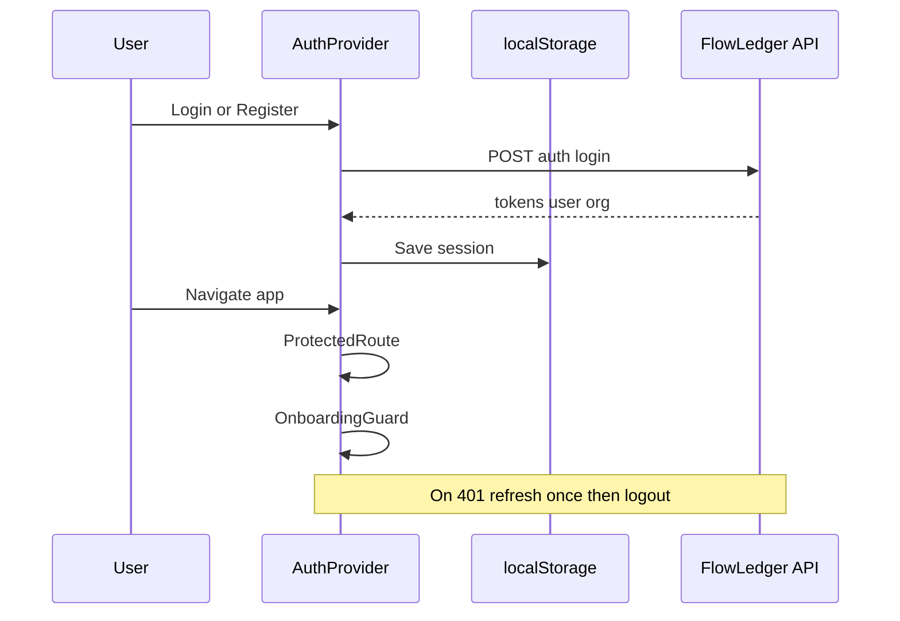
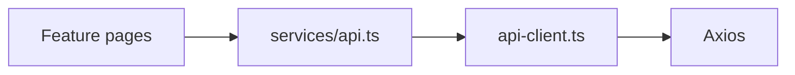
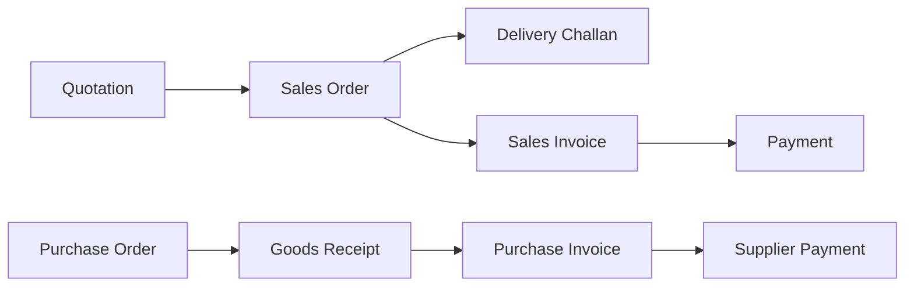
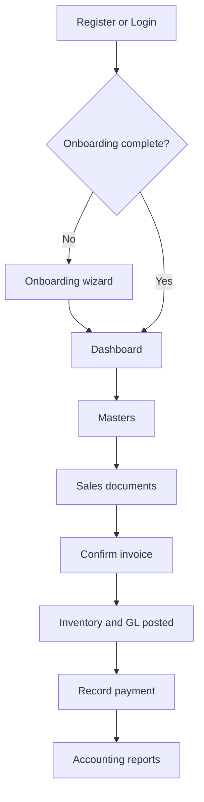
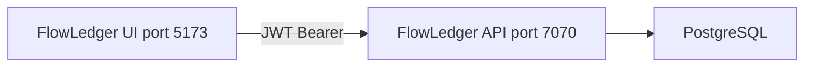

# FlowLedger UI

React + TypeScript ERP frontend for [FlowLedger API](../FlowLedgerAPI). Multi-tenant, role-aware SPA with modules for sales, purchases, inventory, accounting, CRM, and settings.

## Stack

| Layer | Technology |
|-------|------------|
| Build | Vite 8, TypeScript 6 |
| UI | React 19, Tailwind CSS v4 |
| Routing | React Router 7 |
| Server state | TanStack React Query 5 |
| HTTP | Axios (JWT + refresh interceptor) |
| Forms | React Hook Form + Zod |
| Components | Radix UI primitives (shadcn-style) |
| Charts | Recharts |
| Toasts | Sonner |
| Email editor | react-email-editor (Unlayer) |

---

## Architecture

### High-level view



### Application shell



| Component | Path | Role |
|-----------|------|------|
| `App.tsx` | `src/App.tsx` | `RouterProvider` |
| `providers.tsx` | `src/app/providers.tsx` | Query client, auth, toasts |
| `router.tsx` | `src/app/router.tsx` | All routes |
| `AppLayout` | `src/components/layout/AppLayout.tsx` | Sidebar + header shell |
| `AppSidebar` | `src/components/layout/AppSidebar.tsx` | Navigation (RBAC-filtered) |
| `PageChrome` | `src/components/layout/PageChrome.tsx` | PageHeader, MetricCard, EmptyState |

### Directory layout

```
src/
├── app/              # Router, providers
├── features/         # Domain pages (one folder per module)
│   ├── auth/
│   ├── accounting/
│   ├── sales/
│   ├── inventory/
│   ├── shared/       # Generic entity CRUD
│   └── …
├── components/
│   ├── layout/       # Shell, sidebar, page chrome
│   └── ui/           # Design system primitives
├── services/         # API client modules
├── lib/              # api-client, permissions, utils
└── types/            # Shared TypeScript types
```

---

## Authentication and session flow



### Session model

- Stored in `localStorage` as `flowledger.auth`: `accessToken`, `refreshToken`, `user`, `activeOrganization`, `organizations`.
- **Protected routes** redirect to `/login` without a valid org.
- **Onboarding guard** sends `ORGANIZATION_ADMIN` to `/onboarding` until complete.
- **Role guard** (`RequireRole`) for admin-only settings.
- **Permissions** — client-side RBAC in `src/lib/permissions.ts`; sidebar uses `canAccessModule()`.

### Public routes

`/login`, `/register`, `/forgot-password`, `/reset-password`, `/accept-invite`

**Key files:** `src/features/auth/auth.tsx`, `src/lib/api-client.ts`, `src/lib/permissions.ts`

---

## API client layer



| File | Purpose |
|------|---------|
| `lib/api-client.ts` | Axios instance, JWT attach, 401 refresh, session R/W |
| `services/api.ts` | Domain APIs: `authApi`, `salesApi`, `accountingApi`, etc. |
| `lib/api-response.ts` | `unwrapApi`, `unwrapPage`, `unwrapList` |
| `lib/api-error.ts` | Error messages, form field mapping |
| `types/api.ts` | Request/response TypeScript types |

**Base URL resolution:**

1. `VITE_API_BASE_URL` if set
2. Default: `http://localhost:7070/api/v1`
3. On HTTPS production host: `https://apiflowledger.valiantxgroup.com/api/v1`

---

## Feature modules and routes

All authenticated routes live under `AppLayout` with `ProtectedRoute` + `OnboardingGuard`.

### Dashboard

| Route | Page |
|-------|------|
| `/` | Dashboard KPIs + sales trend chart |

### Masters (shared entity pattern)

| Route pattern | Entity |
|---------------|--------|
| `/{kind}`, `/{kind}/new`, `/{kind}/:id`, `/{kind}/:id/edit` | customers, suppliers, products, categories, warehouses |

Implemented in `src/features/shared/EntityPages.tsx`.

### Inventory

| Route | Purpose |
|-------|---------|
| `/inventory` | Stock overview |
| `/inventory/ledger` | Stock ledger by product |
| `/inventory/adjustments` | Quantity adjustments |
| `/inventory/transfers` | Inter-warehouse transfers |
| `/inventory/opening-stock` | Opening stock entry |

### Sales and purchase document flow



| Module | List | Create | Detail |
|--------|------|--------|--------|
| Quotations | `/sales/quotations` | `/new` | — |
| Sales orders | `/sales/orders` | `/new` | — |
| Delivery challans | `/sales/challans` | `/new` | — |
| Sales invoices | `/sales/invoices` | `/new` | `/sales/invoices/:id` |
| Purchase orders | `/purchases/orders` | `/new` | — |
| GRN | `/purchases/grn` | `/new` | — |
| Purchase invoices | `/purchases/invoices` | `/new` | `/purchases/invoices/:id` |
| Payments | `/payments/received`, `/payments/suppliers` | `/new` | — |

**Files:** `src/features/sales/SalesPages.tsx`, `src/features/sales/InvoiceDetailPages.tsx`

### Accounting

| Route | Purpose |
|-------|---------|
| `/accounting` | Dashboard (P&L, balance sheet, GST) |
| `/accounting/chart-of-accounts` | COA tree/list with expand/collapse |
| `/accounting/journals` | Journal list |
| `/accounting/journals/new` | Manual journal entry |
| `/accounting/journals/:id` | Journal detail |
| `/accounting/reports` | Financial reports hub |
| `/accounting/ledgers/accounts/:id` | Account ledger |
| `/accounting/ledgers/customers/:id` | Customer ledger |
| `/accounting/ledgers/suppliers/:id` | Supplier ledger |

**Files:** `src/features/accounting/AccountingPages.tsx`, `src/features/accounting/ChartOfAccountsPage.tsx`

### CRM and marketing

| Route | Purpose |
|-------|---------|
| `/leads` | Lead pipeline |
| `/marketing/sequences` | Drip sequences |
| `/marketing/campaigns` | Email blast campaigns |
| `/marketing/email-templates` | Unlayer email designs |

### Settings and admin

| Route | Access | Purpose |
|-------|--------|---------|
| `/settings/organization` | Admin | Org profile |
| `/settings/users` | Admin | Team and invites |
| `/settings/billing` | Admin | Plan and usage |
| `/settings/tax-rates` | Admin | GST rates |
| `/settings/units` | Admin | Units of measure |
| `/settings/reminder-rules` | Admin | Payment reminders |
| `/settings/password` | All | Change password |
| `/templates` | All | Invoice PDF templates |
| `/audit` | All | Audit log |

---

## Design system

### Tokens and globals

`src/index.css` — Tailwind v4 theme, brand colors, typography, table/form/empty-state utilities, COA tree styles.

### UI primitives (`src/components/ui/index.tsx`)

`Button`, `Input`, `Card`, `Badge`, `Table`, `Field`, `Dialog`, `Select`, `Tabs`, `Skeleton`, etc.

### Page chrome (`src/components/layout/PageChrome.tsx`)

| Export | Use |
|--------|-----|
| `PageHeader` | Title, subtitle, breadcrumbs, actions |
| `PageShell` | Consistent page spacing |
| `MetricCard` | Dashboard stat tiles |
| `EmptyState` | Loading / empty list states |
| `SectionTitle` | In-page section headings |

---

## User journey



---

## Quick start

Requires **Node 20+**:

```bash
nvm use 20
cp .env.example .env
npm install
npm run dev
```

| Service | URL |
|---------|-----|
| UI | http://localhost:5173 |
| API (default) | http://localhost:7070/api/v1 |

Ensure [FlowLedger API](../FlowLedgerAPI) is running with PostgreSQL and Flyway migrations applied.

### Demo login

If YRV seed is present: `kashyap221@gmail.com` / `passwor123d`

---

## Environment variables

| Variable | Example | Purpose |
|----------|---------|---------|
| `VITE_API_BASE_URL` | `http://localhost:7070/api/v1` | Backend API base URL |
| `VITE_UNLAYER_PROJECT_ID` | optional | Unlayer email editor project |

Files: `.env.example` (local), `.env.production` (deployed)

---

## Scripts

| Command | Description |
|---------|-------------|
| `npm run dev` | Vite dev server (port 5173) |
| `npm run build` | Typecheck + production build |
| `npm run preview` | Preview production build |
| `npm run lint` | oxlint |
| `npm run verify` | Format check + lint + build |

---

## Integration with API



1. UI stores JWT in `localStorage` after login.
2. Every API call sends `Authorization: Bearer <accessToken>`.
3. API resolves tenant from JWT, never from request body.
4. On 401, UI refreshes token once; failure redirects to login.
5. Org switch clears TanStack Query cache and fetches new org context.

---

## Related project

**FlowLedger API** — Spring Boot backend at `../FlowLedgerAPI`. See its README for architecture, migrations, and GL posting flows.
